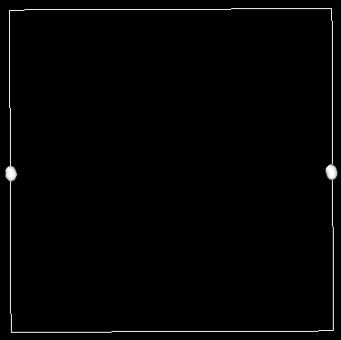
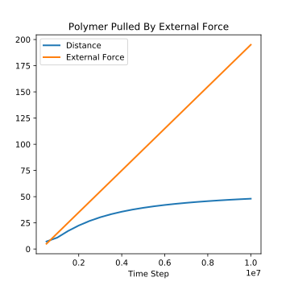
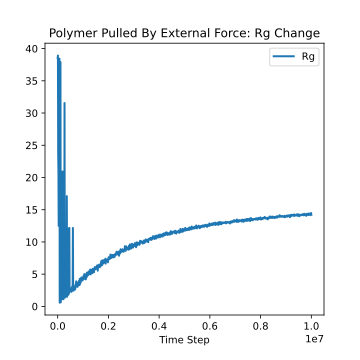
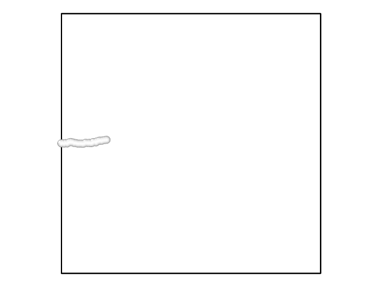
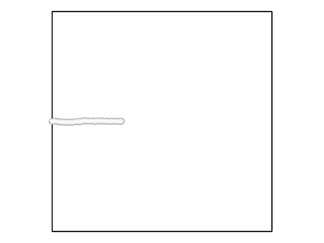
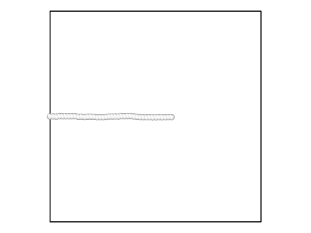

# 使用LAMMPS模拟高分子链被外力拉扯

## 1. 简介
在二维空间生成一个有40个例子,39个键的高分子链。第1个粒子的位置固定，外力施加在第40个粒子上。

外力随时间步长线性增加。统计第一个粒子和最后一个粒子水平距离的变化和回旋半径的变化。

## 2. 动态演化过程
使用Ovito展示时间演化过程: `process_v3.gif`
<p align="center">

</p>


<div style="page-break-after: always;"></div>

## 3. 统计结果

`result.svg`

<p align="center">

</p>

### 利用公式计算回旋半径

回旋半径:

$$
R^2_g = \frac{1}{n}\sum_{i=0}^n(r_i -r_c)^2 
$$

其中质心到原点的距离:

$$
r_c = \frac{\sum{_i^nm_i\vec{r_i}}}{\sum{_{i=0}^nm_i}} = \frac{\sum{_{i=0}^n\vec{r_i}}}{n} 
$$

这个例子是二维的,因此:

$$
r_i = \sqrt{x_i^2+y_i^2}
$$


<p>

</p>


<div style="page-break-after: always;"></div>

## 附录: 

1. 截图

|    |   |
| -------------- | --------------- |
|  |   |
|  |  |

<div style="page-break-after: always;"></div>
2. 文件说明:

   ```
   .
   ├── dist_vs_force (记录距离和力的变化的文件)
   ├── dist_vs_force_pure
   ├── dist_vs_force,v
   ├── lammps.out (输出文件，记录每个例子的坐标变化)
   ├── log.lammps
   ├── PlotData.ipynb(Jupyter Notebook文件)
   ├── PlotData.py (作统计图的Python程序)
   ├── poly1.input (例子的初始位置)
   ├── pull.lam (in文件)
   ├── pic (图片)
   │   ├── 0.png
   │   ├── 1000.png
   │   ├── 100.png
   │   ├── 200.png
   │   ├── 400.png
   │   ├── 50.png
   │   ├── 800.png
   │   ├── process_v1.gif
   │   ├── process_v2.gif
   │   ├── process_v3.gif
   │   ├── rg.png
   │   ├── rg.svg
   │   ├── result.png
   │   └── result.svg
   ├── README.md (结果展示文档)
└── report.pdf
   ```
   
   

参考:[[1](http://www.zqex.dk/index.php/teaching/lammps-demo)] http://www.zqex.dk/index.php/teaching/lammps-demo